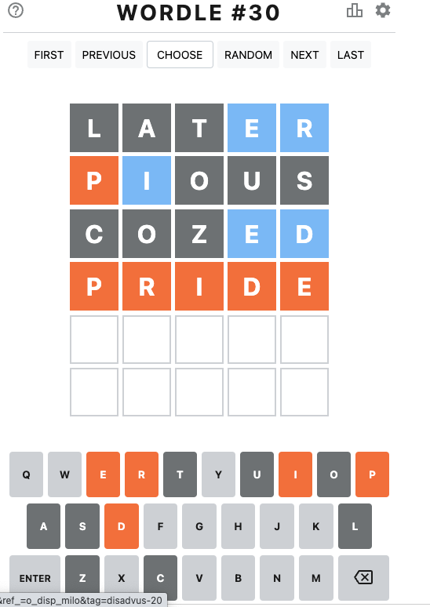

Wordle solver
-------------

To use:

    % python3 program.py

    enter your guess word: later   
    right indexes, separated by space: 
    mismatched indexes, separated by space: 3 4
    possible words: ['beers', 'beery', 'bergs', 'berko', 'berks', 'berme', 'berms', 'berob', 'berry', 'biers'] (497 total)
    suggested letters: {'m', 'b', 'q', 'w', 'i', 'u', 'f', 'o', 'h', 'n', 'j', 'c', 's', 'd', 'x', 'k', 'y', 'g', 'v', 'z', 'p'}
    state: WordleSolver.StateData(rightChars={}, misplacedChars={3: 'e', 4: 'r'}, badChars={'l', 't', 'a'})
    recommended words: ['oners', 'renos', 'seron', 'snore', 'deros', 'doers', 'dorse', 'redos', 'resod', 'ceros'] (336 total)
    recommended fresh words: ['dinos', 'cions', 'coins', 'icons', 'scion', 'sonic', 'inspo', 'opsin', 'pions', 'psion'] (633 total)
    recommended vowel-fresh words: ['pious', 'onium', 'duomi', 'odium', 'opium', 'quino', 'quoin', 'fugio', 'coqui', 'quipo'] (633 total)
    
    enter your guess word: pious
    right indexes, separated by space: 0
    mismatched indexes, separated by space: 1
    possible words: ['preif', 'price', 'pride', 'prime', 'prize'] (5 total)
    suggested letters: {'d', 'm', 'z', 'f', 'c'}
    state: WordleSolver.StateData(rightChars={0: 'p'}, misplacedChars={3: 'e', 4: 'r', 1: 'i'}, badChars={'a', 't', 'l', 'o', 'u', 's'})
    recommended words: ['pride', 'price', 'prime', 'preif', 'prize'] (5 total)
    recommended fresh words: ['chynd'] (1 total)
    recommended vowel-fresh words: ['chynd'] (1 total)
    last-ditch fresh words: ['comfy', 'cozed', 'decaf', 'demic', 'domic', 'faced', 'famed', 'fazed', 'fumed', 'fuzed', 'maced', 'mafic', 'mazed', 'medic', 'mozed', 'mucid', 'zymic', 'ached', 'acidy', 'acmic'] (1838 total)
    
    enter your guess word: cozed
    right indexes, separated by space: 
    mismatched indexes, separated by space: 3 4
    possible words: ['pride'] (1 total)
    suggested letters: {'r'}
    state: WordleSolver.StateData(rightChars={0: 'p'}, misplacedChars={3: 'e', 4: 'd', 1: 'i'}, badChars={'a', 't', 'l', 'o', 'u', 'z', 'c', 's'})
    recommended words: ['pride'] (1 total)
    recommended fresh words: [] (0 total)
    recommended vowel-fresh words: [] (0 total)
    last-ditch fresh words: ['aargh', 'abear', 'abhor', 'abore', 'abram', 'abray', 'abrim', 'abrin', 'aerie', 'afara', 'afear', 'afire', 'afore', 'agger', 'aggri', 'aggro', 'aggry', 'agree', 'agria', 'agrin'] (1569 total)
    
    enter your guess word: 

